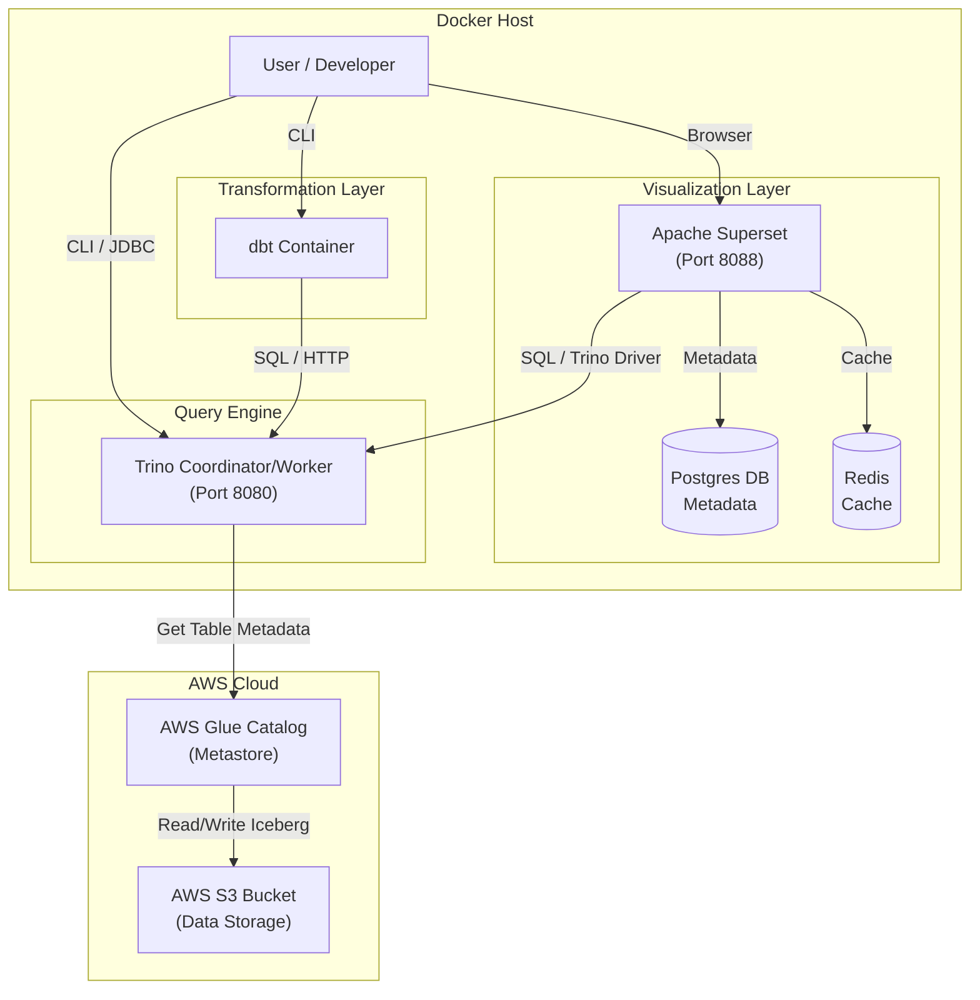

# System Architecture

This diagram illustrates how the different components in this Docker stack interact with each other and with AWS services.

## Component Roles

*   **Trino**: The central query engine. It processes SQL queries from dbt and Superset and executes them against data stored in S3.
*   **AWS Glue**: Acts as the catalog (metastore) for Iceberg tables, storing schema definitions and table locations.
*   **AWS S3**: The actual storage layer where data files (Parquet/Iceberg) are kept.
*   **dbt**: Handles data transformation. It compiles SQL models and runs them on Trino to create/update tables in S3.
*   **Superset**: The BI tool. It connects to Trino to visualize the data.
    *   **Postgres**: Stores Superset's internal configuration (dashboards, users, etc.).
    *   **Redis**: Caches query results for Superset to improve dashboard performance.
